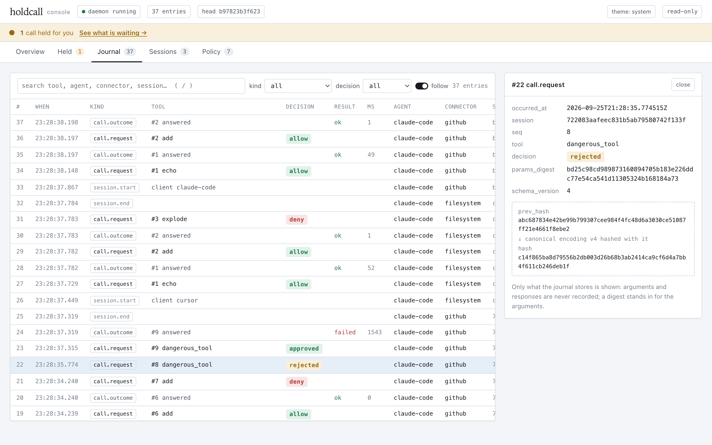

# Nim

Nim is a local process that sits between an MCP client — Claude Code, Cursor,
Claude Desktop — and the MCP servers it spawns. It holds each server's
credentials, decides whether every `tools/call` is allowed before it reaches
a server, and records the decision in an append-only, hash-chained journal.
Nothing else in the protocol is touched: everything that is not a
`tools/call` is forwarded byte for byte.

It is for a developer who already runs one of those clients with MCP servers
configured and wants three things none of them give you on their own: a
record of what a tool was asked to do, a way to refuse one by name before it
runs, and each server's credential kept out of a client's plaintext config
and away from the servers it isn't registered for. It is pre-alpha — see
Status below for exactly what that means before you point it at something
you cannot afford to have go wrong.

## Status

Pre-alpha, and honest about it. What works:

- **A relay a real client cannot distinguish from a direct connection.** Tool
  list, schemas, unicode, a 512 KiB payload, error propagation and ping all
  pass through unchanged, and the two things that must differ — a refused
  call, a frame Nim will not read — differ exactly as documented
  (`tools/relay-rig`, re-run against the current binary on 2026-09-15 under
  both the `initialize` and the `server/discover` handshake, and now a CI
  job).
- **Refusal.** A `tools/call` is decided before it is forwarded, and the
  decision is written to the journal before the relay acts on it. A refused
  call never leaves Nim.
- **An append-only, hash-chained record** (`nim log`, `nim verify`, `nim
  console`), and **credentials out of the client's config file**, into the
  OS credential store, injected only into the one server each is registered
  for.
- **Agent identity, derived rather than declared**, from the executable the
  kernel reports for the process that spawned the relay; nothing on the wire
  names an agent.
- **Policy in SQLite**, per agent and per connector, with a stated precedence
  between `allow` and `deny`. Every change is an entry in the journal;
  `config.toml` carries no policy at all — a file that still does is refused.
- **Budgets.** A cap on how many *allowed* calls one session may make,
  scoped like a rule and checked only once the rules have allowed the call —
  a budget narrows, never grants. Decremented at authorization time: a call
  the relay gave up on still spent its share, a refusal never does, and a
  restarted relay is a new session with a fresh count.
- **Human approval.** A third rule effect, `ask`, holds a call in the
  daemon's memory until `nim approve` or `nim reject` decides it, or nobody
  does and it is rejected. `nim approve` shows the call's real parameters,
  every byte as itself, never a model-written summary; the decision is in
  the journal before the relay acts on it.
- **`nim init` and `nim doctor`** — pointing a client at Nim, and checking
  the result, without hand-editing JSON.

`docs/milestones.md` is the order the rest comes in; see *What does not
exist yet* below.

## Failing closed

Every way of not getting a decision is a denial: no daemon, a slow daemon, a
closed socket, an answer to a different question, a journal write that failed.
There is no path on which a `tools/call` reaches a server without a decision
behind it.

The one thing that is deliberately *not* a denial is the absence of
configuration. A connector nobody set up is not a failure, and those servers
keep working untouched. `docs/decisions/0001-failure-behaviour.md` sets out
why those are different questions.

## Install

**From a release**, once one exists — no version has been tagged yet (see
`CHANGELOG.md`):

```bash
curl -fsSL https://raw.githubusercontent.com/BySergiMM/nim/m1-bootstrap/install.sh | sh
```

POSIX `sh`, never `sudo`, writes only inside `NIM_INSTALL_DIR` (default
`$HOME/.local/bin`). Resolves the latest GitHub release, or
`NIM_VERSION=vX.Y.Z` to pin one, checks the archive's SHA-256 against that
release's `SHA256SUMS`, and refuses — nothing written — on any mismatch.
Windows has no `sh`: take the `.zip` from the release page.

**From source** — see *Building* for the requirements:

```bash
cd engine && go build -o bin/nim ./cmd/nim
```

A release binary adds the ldflags that make `nim version` report something
other than `0.0.0-dev`, the same ones `.github/workflows/release.yml` uses
per target:

```bash
go build -trimpath -ldflags "-s -w -X main.version=$TAG \
    -X main.commit=$(git rev-parse HEAD) -X main.builtAt=$(date -u +%Y-%m-%dT%H:%M:%SZ)" \
    -o bin/nim ./cmd/nim
```

**After upgrading**, if a daemon from the old binary is still running: a
replaced binary and a running daemon become different images, so they refuse
each other (`nim status` says `daemon   OLDER BUILD`). Run `nim daemon
restart` — it asks the old daemon to exit and starts a new one from the
binary now on disk, then confirms the new one answers before returning.

## Five minutes to a first decision

The full walkthrough, with before/after config examples per client, is
`docs/getting-started.md`. Short version:

```bash
nim init                # dry run: shows what it would rewrite, touches nothing
nim init --write        # applies it, after backing up every file it changes
nim init --undo <backup path nim init --write printed>
```
Finds Claude Code's, Cursor's and Claude Desktop's config files and rewrites
each stdio server to route through Nim; `--undo` restores one file from its
backup.

```bash
nim doctor
```
One line per check — PATH, `config.toml`, the daemon, the journal, the
credential store, enrolments, rules, connectors, client configs — `OK`,
`WARN` or `FAIL`, with a remedy. Exits 1 only on a `FAIL`.

```bash
nim policy deny <tool-name>    # recorded as a rule.add entry
```
Ask your client to call that tool: it comes back as a tool error, because
the call never reached the server that would have run it.

```bash
nim log        # shows the call: deny, no result
nim console    # the same journal, plus sessions and policy, at 127.0.0.1:7717
```



The console is read-only and serves loopback only; `/#journal`, `/#sessions`
and `/#policy` open a tab directly.

## Policy

A rule is `deny`, `allow` or `ask`, scoped to a tool and, optionally, one
enrolled agent and one connector:

```bash
nim policy deny delete_repository                        # for everyone
nim policy deny delete_repository --agent cursor         # for one client program
nim policy allow force_push --agent claude-code --connector github
nim policy default deny                                  # every tool, unless something more specific says otherwise
nim policy remove delete_repository                       # or --default
nim policy list
nim policy explain force_push --agent claude-code --connector github
nim policy ask delete_branch --connector github               # hold it for a human
nim approve                                                    # what is held, with its real arguments
nim approve <id>                                               # or: nim reject <id> --reason "not that branch"
nim policy budget 20 --tool list_repos --agent claude-code    # at most 20 allowed calls per session
nim policy budget 100 --all-tools --connector github          # every tool on one connector, per session
nim policy budget remove --tool list_repos --agent claude-code
```

**Precedence, in one sentence:** the most specific matching rule wins — an
exact tool beats a default, naming the agent or the connector beats not
naming it — a tie at equal specificity goes to deny, then ask, then allow,
and no matching rule at all is allow.

**What an unenrolled program may do, in one sentence:** a session no
enrolment matched is bound only by the rules that name no agent, so a plain
`deny` is a ceiling nothing escapes by staying unenrolled, and `nim policy
default deny` plus an agent-scoped `allow` is the allow-list that ceiling
alone could not express — `docs/decisions/0002-what-an-unknown-agent-may-do.md`
and `docs/decisions/0003-allow-rules-and-precedence.md` argue both halves.

Every rule added or removed is a `rule.add` or `rule.remove` entry in the
chain, in the same transaction as the rule; a budget is a `budget.add` or
`budget.remove` entry the same way. A budget never grants — it only lowers
what the rules already allow, per session (`docs/decisions/0004-budgets.md`).

## Agents

```bash
nim agent add cursor /Applications/Cursor.app/Contents/MacOS/Cursor
nim agent list
nim agent remove cursor
```

An agent is a client program, enrolled by the executable it runs — the file
the kernel reports for the process that spawned the relay, matched against
enrolments made this way; nothing on the wire names an agent. Two windows of
the same program are the same agent, because they run the same file:
enrolment identifies an executable, not a running instance. Re-enrolling a
name against a different path moves what that name means, including every
rule scoped to it. Enrolling one is as privileged as running Nim itself —
the journal, not the enrolment, is what makes that visible afterwards.

## Credentials

A connector names the one downstream server its secret may be injected into.
That binding is what authorizes the credential, so it is required:

```bash
echo "$GITHUB_TOKEN" | nim connector set github --env GITHUB_TOKEN \
    -- npx -y @modelcontextprotocol/server-github

nim serve --connector github        # runs the registered server, with the token
```

The secret is never a command-line argument and never reaches SQLite. A command
given on the command line is ignored when a connector supplies one: the daemon
decides what receives a credential, not the caller.

Both ends of the daemon socket verify each other by peer identity, so neither
a process pretending to be a shim nor one pretending to be the daemon gets in.

## What the record is, and is not

The journal is append-only and hash-chained, and `docs/journal-format.md` is
the normative definition of the encoding, the chain, and — importantly — what
the chain does not protect against.

The short version: it detects corruption, partial writes and edits made by
anything that does not know the chain exists. It does **not** detect a local
attacker who can write to `nim.db`, because nothing in the construction is
secret and the whole chain can be recomputed. Only a head recorded elsewhere
(`nim verify --expect-head`) covers that.

Do not describe it as tamper-proof, tamper-evident, or an immutable audit log.

Policy and enrolment changes are entries in the chain too, not a separate
record with weaker guarantees: `rule.add`, `rule.remove`, `agent.add`,
`agent.remove`, `budget.add` and `budget.remove` are each written in the same
SQLite transaction as the change they describe, so the rules, the budgets and
the enrolments they are scoped to have a history that verifies exactly like
the calls do.

## What does not exist yet

- **A hosted journal viewer.** M8, now planned rather than blocked: D-004
  decided on 2026-09-16 that the mirror presents what this machine
  reported, labelled as such on every row, and holds pinned heads apart from
  synced rows (`docs/decisions/0006-what-the-mirror-may-claim.md`). It needs
  a hosting account, which is the operator's to provide.
- **Conditions on a call's arguments, or on time.** A rule matches `(agent,
  connector, tool)` and nothing else.
- **Anything run on Windows.** DPAPI credential storage and all five
  cross-compiled targets exist, but no code here has ever executed on a
  real Windows machine — see *Building* and `docs/security.md`'s *Known
  gaps* table.

`docs/milestones.md` has the test names behind every claim above, and
`docs/architecture.md` says where each layer lives and what one call goes
through.

## Shape

```
engine/      Go. The daemon, the shim, the journal and the console.
dashboard/   A static page of what is true about this repository, built from it.
docs/        Architecture, security posture, decisions, and the journal's format.
supabase/    The schema a journal mirror would land in. Nothing writes to it.
tools/       The relay rig: a real MCP client, run direct and through Nim.
```

The engine keeps working with no network. `dashboard/` is deployed publicly
(D-003) and shows no runtime state; the hosted journal viewer is M8 and does
not exist.

## Building

```bash
cd engine && go build -o bin/nim ./cmd/nim
```

Go 1.26.6 or newer, which the `go` directive fetches on demand. No C
toolchain: the SQLite driver is pure Go, so the engine cross-compiles for
darwin, linux and windows with `CGO_ENABLED=0`.

Everything has been run on darwin/arm64. Linux is exercised in CI; **no code
in this project has ever been run on Windows**, only cross-compiled, and two
of its security properties are known not to hold there — see the *Known gaps*
table in `docs/security.md`.

### Running CI without GitHub's runners

`.github/workflows/ci.yml` is the source of truth, and `tools/ci-local.sh`
runs the same jobs with the same commands and assertions on the machine it
is started on: format, vet, tidy, `go test -race -shuffle -v` with the
evidence script, the five cross-compiles, govulncheck, the dashboard's
check and build, and the relay rig. `tools/ci-linux.sh` runs the Linux leg
inside a local [Lima](https://lima-vm.io) virtual machine, which is the only
way `peer_linux.go` and the Linux credential store get executed when the
hosted runners are not available. Neither can be Windows.

```bash
tools/ci-local.sh              # every job, here
tools/ci-local.sh test vuln    # a subset
tools/ci-linux.sh              # the same, in an Ubuntu VM (needs limactl)
```

## Performance

`docs/benchmarks.md`, with the commands that reproduce every figure. The
decision a call waits for costs p99 0.27 ms including the durable write.

## Where the project actually stands

`dashboard/` builds a page listing every guarantee alongside what it does *not*
guarantee, every attack anyone has tried against Nim including the ones that
worked, and every known weakness. It is generated from this repository and
refuses to build if a claim cites a test that does not exist — which is how it
avoids becoming another document that drifts from the code. `docs/dashboard.md`
explains the design and, more usefully, what it deliberately cannot show.

    cd dashboard && npm install && npm run check && npm run dev

It shows no runtime state and never will: the journal, sessions, enrolled
agents and rules live on the machine running Nim. `nim console` serves the
journal and its sessions over loopback; `nim agent list` and `nim policy list`
show the rest.

## Licence

MIT.
